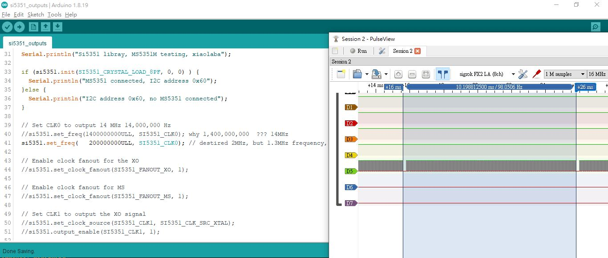

# MS5351_Si5351_testing
MS5351 and Si5351, many sayings they are equivalent and no need to code change and comprehensive pin-to-pin replacement, let me try...

  


PIN connection  
UNO      - Si5351 module (FAKE), actual chip is MS5351M  
A4 (SDA) - SDA  
A5 (SCL) - SCL  
5V       - Vin  
GND      - GND  


clone and try this library,  
https://github.com/etherkit/Si5351Arduino

example code, something is missing and I did not undestand yet.

this is code snipet  
```
  // Set CLK0 to output 14 MHz 14,000,000 Hz
  //si5351.set_freq(1400000000ULL, SI5351_CLK0); why 1,400,000,000  ??? 14MHz x 100 ??
  si5351.set_freq(   200000000ULL, SI5351_CLK0); // destired 2MHz, but 1.3MHz frequency, why ?
```


### the complete code
[si5351_outputs/](si5351_outputs/)  
as library provided, modified a bit to used to test the MS5351, change to 2MHz, commented as many as possible to see thay pulse chain pasued 200us at every period of 98Hz.  

### the result
desired 2MHz clock output at clk0, but.....and why ?

2MHz_vs_1.3MHz.JPG  
  

pause_200us_98Hz_why.JPG
  

   
S5351_MS5351_compare1.JPG
  


### my own pure-C source and project, the same result
no uses any library of Si5351,
uses Arduino UNO and MS5351 as test platform.  
complete project file, build.bat will build hext and burn to UNO (Atmega328 chip)  
[C_testing_done/](C_testing_done/)  
